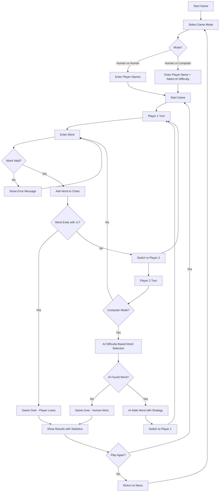

# 🎯 Shiritori Game

A beautiful, interactive Japanese word game built with React that challenges players to create word chains following traditional Shiritori rules.

  

## 🌟 Features

- **Dual Game Modes**: Human vs Human and Human vs Computer
- **Bilingual Support**: English and Japanese interface with automatic language detection
- **Smart AI Opponent**: Advanced algorithm with 4 difficulty levels for computer gameplay
- **Real-time Validation**: Instant feedback on word validity and Japanese character input
- **Timer System**: 30-second countdown for each turn with visual warnings
- **Beautiful UI**: Smooth animations and modern design using Framer Motion
- **Responsive Design**: Works on desktop and mobile devices
- **Advanced AI Strategies**: Multi-layered word selection algorithms

## 🎮 Game Rules

Shiritori (しりとり) is a traditional Japanese word game where players take turns saying words that begin with the last letter of the previous word.

### Core Rules:
1. **Word Chain**: Each word must start with the last letter of the previous word
2. **No Repeats**: Words cannot be used more than once
3. **No "ん" Endings**: Words ending with "ん" (n) cause the player to lose
4. **Time Limit**: 30 seconds per turn with visual countdown
5. **Japanese Characters Only**: Only Hiragana and Katakana are allowed
6. **Character Matching**: Advanced logic handles Hiragana/Katakana equivalence

### Character Matching Logic:
The game implements sophisticated character matching that handles:
- **Hiragana/Katakana Equivalence**: あ = ア, か = カ, etc.
- **Small Character Matching**: ゃ matches や, ゅ matches ゆ, ょ matches よ
- **Voiced/Unvoiced Consonants**: が matches か, ざ matches さ, etc.

## 🏗️ Project Architecture

### Tech Stack
- **Frontend**: React 18.2.0 with Hooks (useState, useEffect, useCallback, useMemo, useRef)
- **Styling**: CSS3 with Framer Motion animations
- **Internationalization**: react-i18next with browser language detection
- **Icons**: Lucide React
- **Build Tool**: Create React App

### Project Structure
```
src/
├── components/          # React components
│   ├── GameMode.js     # Game mode selection
│   ├── HumanVsHuman.js # Human vs Human gameplay
│   ├── HumanVsComputer.js # Human vs Computer gameplay with AI
│   └── LanguageSwitcher.js # Language toggle
├── utils/
│   └── japaneseUtils.js # Japanese character utilities
├── i18n.js             # Internationalization setup
├── App.js              # Main application component
└── index.js            # Application entry point
```

## 🧠 AI Logic & Word Selection

### Computer Word Selection Algorithm

The AI opponent uses a sophisticated multi-layered approach to select words with 4 difficulty levels:

#### 1. **First Word Selection Strategy**
```javascript
// Enhanced first word selection based on difficulty
if (aiDifficulty === 'expert') {
  // Expert: Choose letters that have many long words
  const letterScores = firstLetters.map(letter => ({
    letter,
    score: japaneseWords[letter].filter(word => !word.endsWith("ん")).length * 2 +
           japaneseWords[letter].filter(word => word.length >= 4).length * 3
  }));
  letterScores.sort((a, b) => b.score - a.score);
  selectedLetter = letterScores[0].letter;
} else if (aiDifficulty === 'hard') {
  // Hard: Choose letters with many available words
  const letterScores = firstLetters.map(letter => ({
    letter,
    score: japaneseWords[letter].filter(word => !word.endsWith("ん")).length
  }));
  letterScores.sort((a, b) => b.score - a.score);
  selectedLetter = letterScores[Math.floor(Math.random() * Math.min(3, letterScores.length))].letter;
} else {
  // Easy/Medium: Random selection
  selectedLetter = firstLetters[Math.floor(Math.random() * firstLetters.length)];
}
```

#### 2. **Subsequent Word Selection with Fallback Strategies**
```javascript
// Strategy 1: Direct target character match
availableWords = japaneseWords[targetChar]?.filter(
  word => !usedWords.includes(word) && !word.endsWith("ん")
) || [];

// Strategy 2: Fallback to original character
if (availableWords.length === 0 && targetChar !== lastChar) {
  availableWords = japaneseWords[lastChar]?.filter(
    word => !usedWords.includes(word) && !word.endsWith("ん")
  ) || [];
}

// Strategy 3: Advanced character matching
if (availableWords.length === 0) {
  for (const [char, words] of Object.entries(japaneseWords)) {
    if (charactersMatch(lastChar, char)) {
      const matchingWords = words.filter(
        word => !usedWords.includes(word) && !word.endsWith("ん")
      );
      if (matchingWords.length > 0) {
        availableWords = matchingWords;
        break;
      }
    }
  }
}

// Strategy 4: Expert-level desperate search with look-ahead
if (availableWords.length === 0 && aiDifficulty === 'expert') {
  // Look ahead to find words that create longer chains
  const validWords = potentialWords.filter(word => {
    const nextChar = word[word.length - 1];
    const nextWords = japaneseWords[nextChar]?.filter(
      w => !usedWords.includes(w) && !w.endsWith("ん")
    ) || [];
    return nextWords.length > 0;
  });
}
```

#### 3. **Difficulty-Based Word Selection**
```javascript
if (aiDifficulty === 'expert') {
  // Expert: Maximum aggression - prefer words that limit human options
  const wordScores = availableWords.map(word => {
    let score = word.length * 2; // Prefer longer words
    
    // Bonus for words ending with characters that have few available words
    const nextChar = word[word.length - 1];
    const nextWords = japaneseWords[nextChar]?.filter(
      w => !usedWords.includes(w) && !w.endsWith("ん")
    ) || [];
    
    if (nextWords.length <= 3) score += 10; // Trap words
    if (nextWords.length <= 1) score += 20; // Dead end words
    
    return { word, score };
  });
  
  wordScores.sort((a, b) => b.score - a.score);
  selectedWord = wordScores[0].word;
  
} else if (aiDifficulty === 'hard') {
  // Hard: Aggressive but not perfect
  const goodWords = availableWords.filter(word => !word.endsWith("ん"));
  const wordsToChooseFrom = goodWords.length > 0 ? goodWords : availableWords;
  
  // Sort by length and add some randomness
  wordsToChooseFrom.sort((a, b) => b.length - a.length);
  
  if (Math.random() < 0.4 && wordsToChooseFrom.length > 1) {
    const randomIndex = Math.floor(Math.random() * Math.min(3, wordsToChooseFrom.length));
    selectedWord = wordsToChooseFrom[randomIndex];
  } else {
    selectedWord = wordsToChooseFrom[0];
  }
}
```

### AI Difficulty Levels

#### **Easy Mode**
- Random word selection
- No strategic thinking
- Good for beginners learning the game

#### **Medium Mode**
- Basic strategy implementation
- Prefers longer words
- 50% randomness for unpredictability

#### **Hard Mode**
- Aggressive word selection
- Avoids words ending with "ん"
- Strategic trap setting
- 40% randomness for balance

#### **Expert Mode**
- Maximum aggression strategy
- Advanced look-ahead algorithms
- Prefers words that limit opponent options
- Creates difficult word chains
- Minimal randomness for consistent performance

## 🌐 Internationalization (i18n.js)

### Language Support
The game provides comprehensive bilingual support with automatic language detection:

#### **English (Default)**
- Complete game interface in English
- Clear instructions and feedback messages
- Professional gaming terminology

#### **Japanese (日本語)**
- Native Japanese language support
- Authentic Shiritori experience
- Cultural context and proper honorifics

### i18n Configuration
```javascript
i18n
  .use(LanguageDetector)
  .use(initReactI18next)
  .init({
    resources: { en, ja },
    fallbackLng: 'en',
    debug: false,
    
    interpolation: {
      escapeValue: false, // React already escapes values
    },
    
    detection: {
      order: ['localStorage', 'navigator', 'htmlTag'],
      caches: ['localStorage'],
    },
    
    react: {
      useSuspense: false,
    }
  });
```

### Translation Structure
The translation system includes:
- **Game Interface**: All UI elements, buttons, and labels
- **Game Messages**: Validation, errors, and success messages
- **AI Difficulty**: Descriptions for each difficulty level
- **Game Rules**: Comprehensive rule explanations
- **Player Communication**: Turn indicators and status messages

### Language Detection Features
- **Automatic Detection**: Browser language preference detection
- **Persistent Storage**: Remembers user's language choice
- **Fallback System**: Defaults to English if translation missing
- **Dynamic Switching**: Real-time language changes without page reload

## 🔄 Game Flow



## 🚀 Getting Started

### Prerequisites
- Node.js (version 14 or higher)
- npm or yarn package manager

### Installation
```bash
# Clone the repository
git clone <repository-url>
cd Shiritori

# Install dependencies
npm install

# Start development server
npm start

# Build for production
npm run build
```

### Available Scripts
- `npm start` - Start development server
- `npm run build` - Build for production
- `npm test` - Run test suite
- `npm run eject` - Eject from Create React App

## 🎯 Game Modes

### Human vs Human
- Two players take turns
- Real-time validation and feedback
- Timer for each player's turn
- Score tracking for both players

### Human vs Computer
- Single player vs AI opponent
- **4 AI Difficulty Levels**: Easy, Medium, Hard, Expert
- Advanced AI algorithm for challenging gameplay
- Computer thinking simulation (1-2 second delay)
- Adaptive difficulty based on available words
- Strategic word selection to limit human options

## 🔧 Technical Implementation

### State Management
- **React Hooks**: Comprehensive state management using modern React patterns
- **useState**: Game state, player info, word tracking, AI difficulty
- **useEffect**: Timer logic, computer turn handling, game flow
- **useCallback**: Performance optimization for complex functions
- **useMemo**: Japanese words database optimization
- **useRef**: Input focus management and timer references

### Performance Optimizations
- **Memoized Word Database**: Prevents recreation of large word arrays
- **Debounced Input Handling**: Efficient user input processing
- **Optimized Word Validation**: Fast character matching algorithms
- **Smooth Animations**: Framer Motion for 60fps animations
- **Efficient Re-renders**: Minimal component updates

### Advanced AI Implementation
- **Multi-Strategy Approach**: 4 different word selection strategies
- **Difficulty Scaling**: AI behavior adapts to selected difficulty
- **Look-ahead Algorithms**: Expert mode considers future word possibilities
- **Trap Setting**: AI tries to limit human player options
- **Fallback Mechanisms**: Multiple strategies ensure AI always finds words

### Responsive Design
- **CSS Grid and Flexbox**: Modern layout systems
- **Mobile-First Approach**: Touch-friendly interface design
- **Adaptive Typography**: Responsive text sizing
- **Cross-Platform Compatibility**: Works on all devices and browsers

## 🎨 UI/UX Features

- **Smooth Animations**: Page transitions and micro-interactions using Framer Motion
- **Visual Feedback**: Color-coded messages and status indicators
- **Accessibility**: Keyboard navigation and screen reader support
- **Modern Design**: Clean, minimalist interface with Japanese aesthetic
- **Difficulty Indicators**: Visual representation of AI difficulty level
- **Timer Visualization**: Countdown with color-coded warnings
- **Player Status**: Clear turn indicators and score tracking

## 🔮 Future Enhancements

- **Word Categories**: Themed word sets (animals, food, etc.)
- **Multiplayer**: Online multiplayer support
- **Statistics**: Player performance tracking and analytics
- **Customization**: Theme selection and personalization options
- **Sound Effects**: Audio feedback and background music
- **Advanced AI**: Machine learning-based word selection
- **Tournament Mode**: Competitive gameplay with rankings
- **Word Definitions**: Japanese-English translations for educational value

## 📱 Browser Support

- Chrome (recommended)
- Firefox
- Safari
- Edge
- Mobile browsers (iOS Safari, Chrome Mobile)

## 🤝 Contributing

Contributions are welcome! Please feel free to submit issues, feature requests, or pull requests.

### Development Guidelines
1. Follow React best practices and hooks patterns
2. Maintain consistent code style and component structure
3. Add tests for new features and AI logic
4. Update documentation for new functionality
5. Ensure cross-browser compatibility
6. Test AI difficulty levels and word selection algorithms

## 📄 License

This project is licensed under the MIT License - see the [LICENSE](LICENSE) file for details.

## 🙏 Acknowledgments

- Japanese language experts for word validation rules and character matching
- React community for excellent documentation and hooks patterns
- Framer Motion team for smooth animations and transitions
- Open source contributors for inspiration and best practices
- AI/ML community for advanced algorithm development

---

**Enjoy playing Shiritori! しりとりを楽しんでください！** 🎮✨
