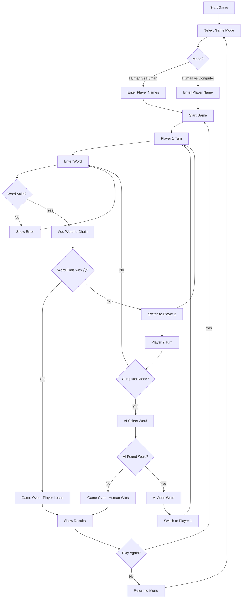

# 🎯 Shiritori Game

A beautiful, interactive Japanese word game built with React that challenges players to create word chains following traditional Shiritori rules.

  

## 🌟 Features

- **Dual Game Modes**: Human vs Human and Human vs Computer
- **Bilingual Support**: English and Japanese interface
- **Smart AI Opponent**: Advanced algorithm for computer gameplay
- **Real-time Validation**: Instant feedback on word validity
- **Timer System**: 30-second countdown for each turn
- **Beautiful UI**: Smooth animations and modern design
- **Responsive Design**: Works on desktop and mobile devices

## 🎮 Game Rules

Shiritori (しりとり) is a traditional Japanese word game where players take turns saying words that begin with the last letter of the previous word.

### Core Rules:
1. **Word Chain**: Each word must start with the last letter of the previous word
2. **No Repeats**: Words cannot be used more than once
3. **No "ん" Endings**: Words ending with "ん" (n) cause the player to lose
4. **Time Limit**: 30 seconds per turn
5. **Japanese Characters Only**: Only Hiragana and Katakana are allowed

### Character Matching Logic:
The game implements sophisticated character matching that handles:
- **Hiragana/Katakana Equivalence**: あ = ア, か = カ, etc.
- **Small Character Matching**: ゃ matches や, ゅ matches ゆ, ょ matches よ
- **Voiced/Unvoiced Consonants**: が matches か, ざ matches さ, etc.

## 🏗️ Project Architecture

### Tech Stack
- **Frontend**: React 18.2.0 with Hooks
- **Styling**: CSS3 with Framer Motion animations
- **Internationalization**: react-i18next
- **Icons**: Lucide React
- **Build Tool**: Create React App

### Project Structure
```
src/
├── components/          # React components
│   ├── GameMode.js     # Game mode selection
│   ├── HumanVsHuman.js # Human vs Human gameplay
│   ├── HumanVsComputer.js # Human vs Computer gameplay
│   └── LanguageSwitcher.js # Language toggle
├── utils/
│   └── japaneseUtils.js # Japanese character utilities
├── i18n.js             # Internationalization setup
├── App.js              # Main application component
└── index.js            # Application entry point
```

## 🧠 AI Logic & Word Selection

### Computer Word Selection Algorithm

The AI opponent uses a sophisticated multi-layered approach to select words:

#### 1. **First Word Selection**
```javascript
// Choose random word that doesn't end with 'ん'
const firstLetters = Object.keys(japaneseWords).filter(letter => letter !== "ん");
const randomLetter = firstLetters[Math.floor(Math.random() * firstLetters.length)];
```

#### 2. **Subsequent Word Selection**
```javascript
// Get target character for next word
const lastChar = lastWord[lastWord.length - 1];
const targetChar = getTargetCharacter(lastChar);

// Find available words starting with target character
let availableWords = japaneseWords[targetChar]?.filter(
  word => !usedWords.includes(word) && !word.endsWith("ん")
) || [];
```

#### 3. **Fallback Strategies**
- **Primary**: Use target character (e.g., if last word ends with か, find words starting with か)
- **Secondary**: Try original character as fallback
- **Tertiary**: Find any character that matches using `charactersMatch()` function

#### 4. **Word Quality Optimization**
```javascript
// Prefer longer words and avoid 'ん' endings
const goodWords = availableWords.filter(word => !word.endsWith("ん"));
const wordsToChooseFrom = goodWords.length > 0 ? goodWords : availableWords;

// Sort by length (prefer longer words)
wordsToChooseFrom.sort((a, b) => b.length - a.length);

// Add randomness for unpredictability
if (Math.random() < 0.3 && wordsToChooseFrom.length > 1) {
  const randomIndex = Math.floor(Math.random() * Math.min(3, wordsToChooseFrom.length));
  return wordsToChooseFrom[randomIndex];
}
```

### Japanese Character Utilities

The `japaneseUtils.js` file provides comprehensive character handling:

- **Character Normalization**: Converts between Hiragana and Katakana
- **Smart Matching**: Handles small characters and voiced consonants
- **Input Validation**: Ensures only valid Japanese characters are accepted

## 🔄 Game Flow



## 🚀 Getting Started

### Prerequisites
- Node.js (version 14 or higher)
- npm or yarn package manager

### Installation
```bash
# Clone the repository
git clone <repository-url>
cd Shiritori

# Install dependencies
npm install

# Start development server
npm start

# Build for production
npm run build
```

### Available Scripts
- `npm start` - Start development server
- `npm run build` - Build for production
- `npm test` - Run test suite
- `npm run eject` - Eject from Create React App

## 🌐 Internationalization

The game supports both English and Japanese languages:

- **English**: Default language with clear instructions
- **Japanese**: Native language support for authentic experience

Language switching is handled through the `react-i18next` library with automatic detection and persistent storage.

## 🎯 Game Modes

### Human vs Human
- Two players take turns
- Real-time validation and feedback
- Timer for each player's turn
- Score tracking for both players

### Human vs Computer
- Single player vs AI opponent
- Advanced AI algorithm for challenging gameplay
- Computer thinking simulation (1-2 second delay)
- Adaptive difficulty based on available words

## 🔧 Technical Implementation

### State Management
- React Hooks for local state management
- `useState` for game state, player info, and word tracking
- `useEffect` for timer logic and computer turn handling
- `useCallback` for performance optimization

### Performance Optimizations
- `useMemo` for Japanese words database
- Debounced input handling
- Efficient word validation algorithms
- Smooth animations with Framer Motion

### Responsive Design
- CSS Grid and Flexbox layouts
- Mobile-first approach
- Touch-friendly interface elements
- Adaptive typography and spacing

## 🎨 UI/UX Features

- **Smooth Animations**: Page transitions and micro-interactions
- **Visual Feedback**: Color-coded messages and status indicators
- **Accessibility**: Keyboard navigation and screen reader support
- **Modern Design**: Clean, minimalist interface with Japanese aesthetic

## 🔮 Future Enhancements

- **Difficulty Levels**: Easy, Medium, Hard AI opponents
- **Word Categories**: Themed word sets (animals, food, etc.)
- **Multiplayer**: Online multiplayer support
- **Statistics**: Player performance tracking
- **Customization**: Theme selection and personalization
- **Sound Effects**: Audio feedback and background music

## 📱 Browser Support

- Chrome (recommended)
- Firefox
- Safari
- Edge
- Mobile browsers (iOS Safari, Chrome Mobile)

## 🤝 Contributing

Contributions are welcome! Please feel free to submit issues, feature requests, or pull requests.

### Development Guidelines
1. Follow React best practices
2. Maintain consistent code style
3. Add tests for new features
4. Update documentation as needed
5. Ensure cross-browser compatibility

## 📄 License

This project is licensed under the MIT License - see the [LICENSE](LICENSE) file for details.

## 🙏 Acknowledgments

- Japanese language experts for word validation rules
- React community for excellent documentation
- Framer Motion team for smooth animations
- Open source contributors for inspiration

---

**Enjoy playing Shiritori! しりとりを楽しんでください！** 🎮✨
